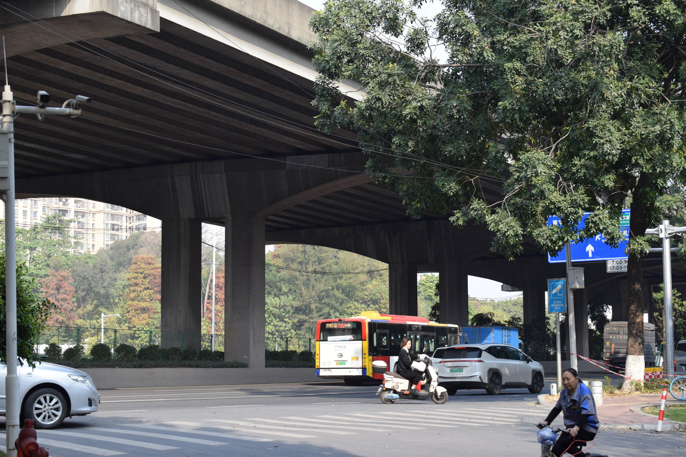
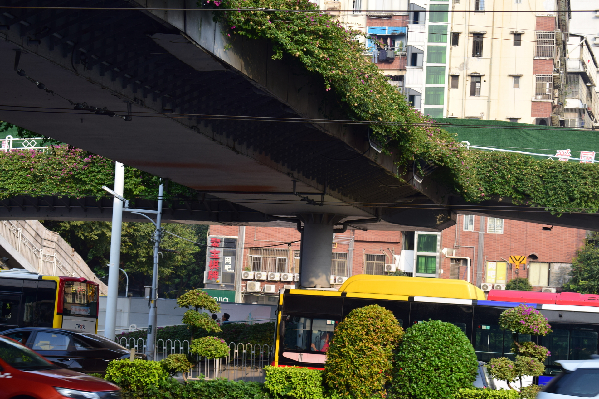
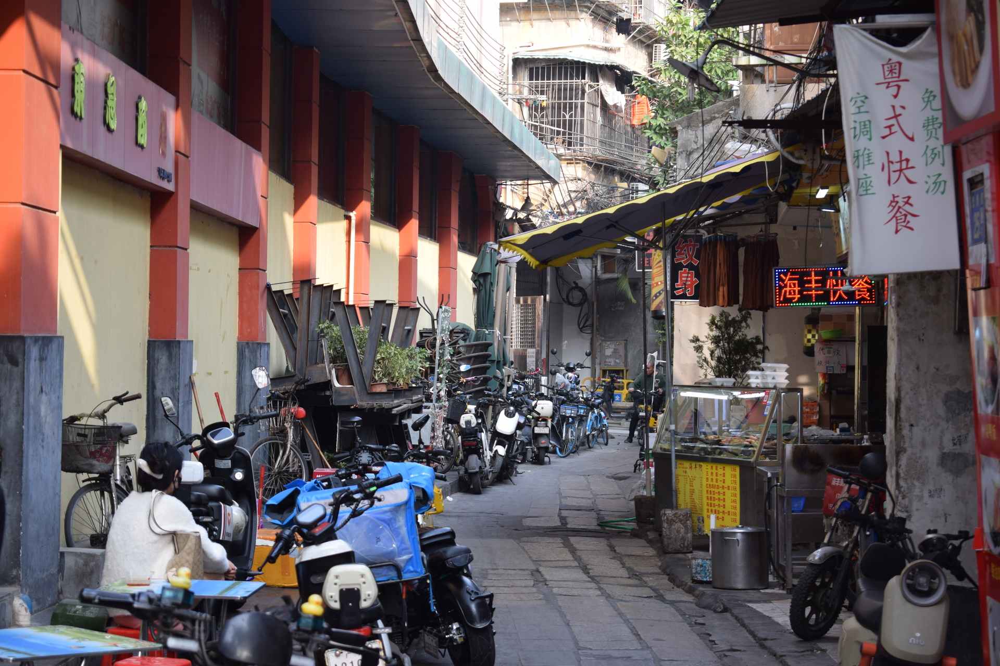
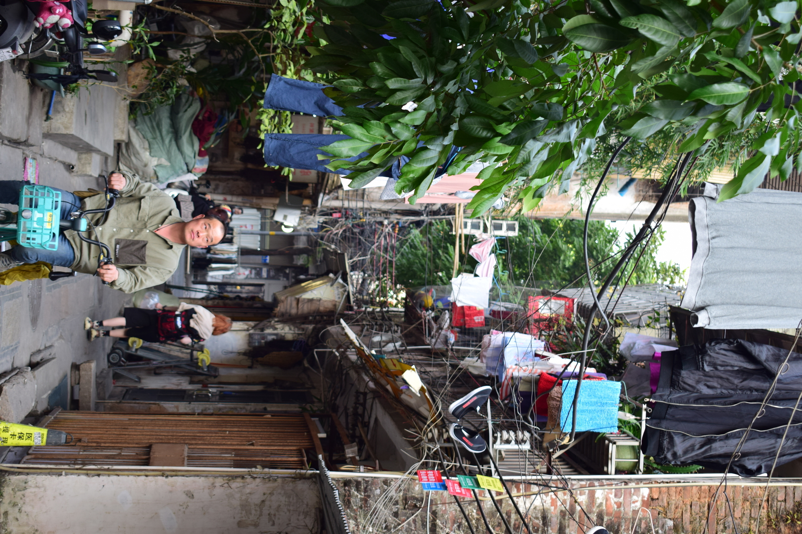
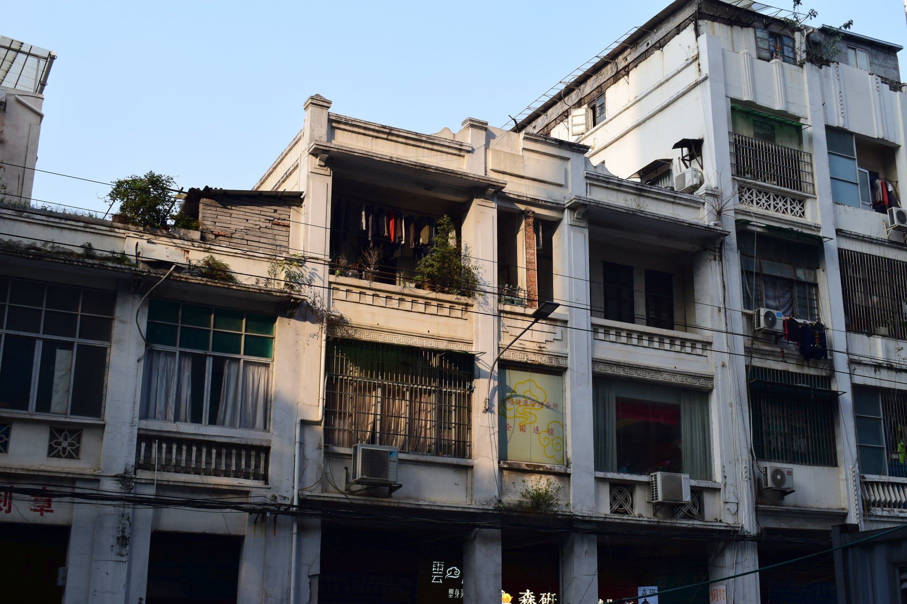
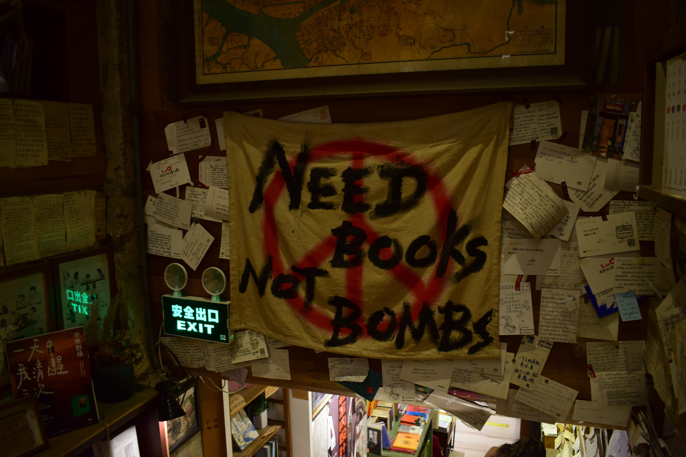
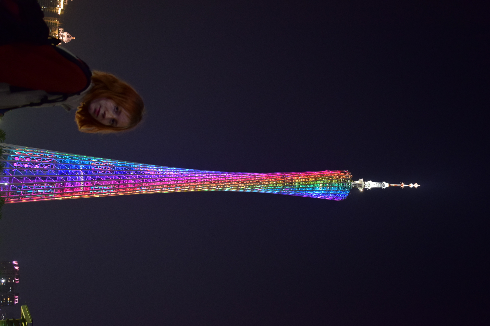

# Гуанчжоу (Guǎngzhōu, 广州)

В Гуанчжоу мы были проездом - провели там всего 1,5 дня, но зато каких!

Приезжаешь в Гуанчжоу, и сразу же утопаешь в водовороте бешеного трафика, шумного городского движа и китайских ярмарок. Хотя что еще можно ожидать от крупнейшего торгово-промышленного центра и города, который входит в китайские топы по численности населения.

Начнем обзор Гуанчжоу с улиц города.

Ошеломляющие многоуровневые трассы.

Красивые многоуровневые трассы.

Вот в доме кто-то уже, наверное, уснул, а Гуанчжоу не спит никогда!

Темп ночной жизни в Гуанчжоу.

Прогуливаясь уже по дневному городу, мы почувствовали довольно интересную атмосферу, не совсем типичную для мегаполиса. Возникали ассоциации с курортом. Город теплый и яркий: солнечный, зеленый. Местами напоминает огромный уличный базар. 

Кстати, такие тут технологичные туалеты. Показывают свободные кабинки на экране снаружи.

Но вернемся к улицам.

Местами Гуанчжоу ошеломляет монструозной архитектурой и инфраструктурой.

Будничный Гуанчжоу.

Доставщики трудятся.

Товарищи-ремонтники трудятся. Похоже, одни мы прохлаждаемся на улицах Гуанчжоу.

Такая уличная еда популярна как на севере Китая, так и на юге. 

В центре города увидели приют для кошек.

Побывали в местном модном книжном магазине.

Как вам такое: “Зов Ктулху” на китайском?

А вот и “Пикник на обочине”.

Дядюшка Фрейд.

Модные здания в центре Гуанчжоу.

Конечно же, высотки.

Высотки с иллюминацией.

Прогулка по Гуанчжоу закончена, а мы поехали дальше - в Шэньчжень!