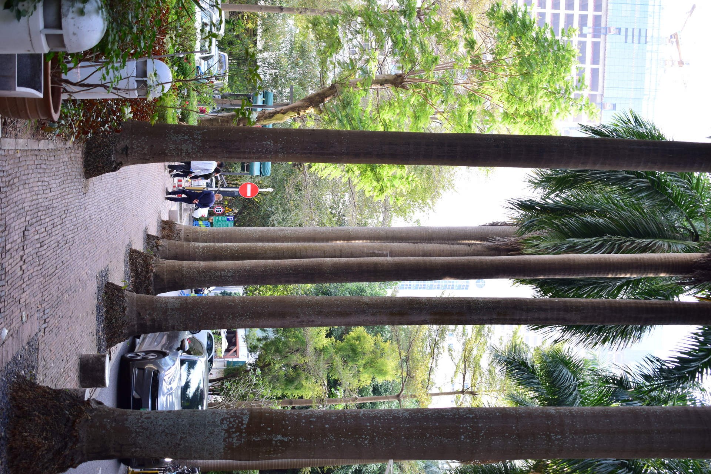
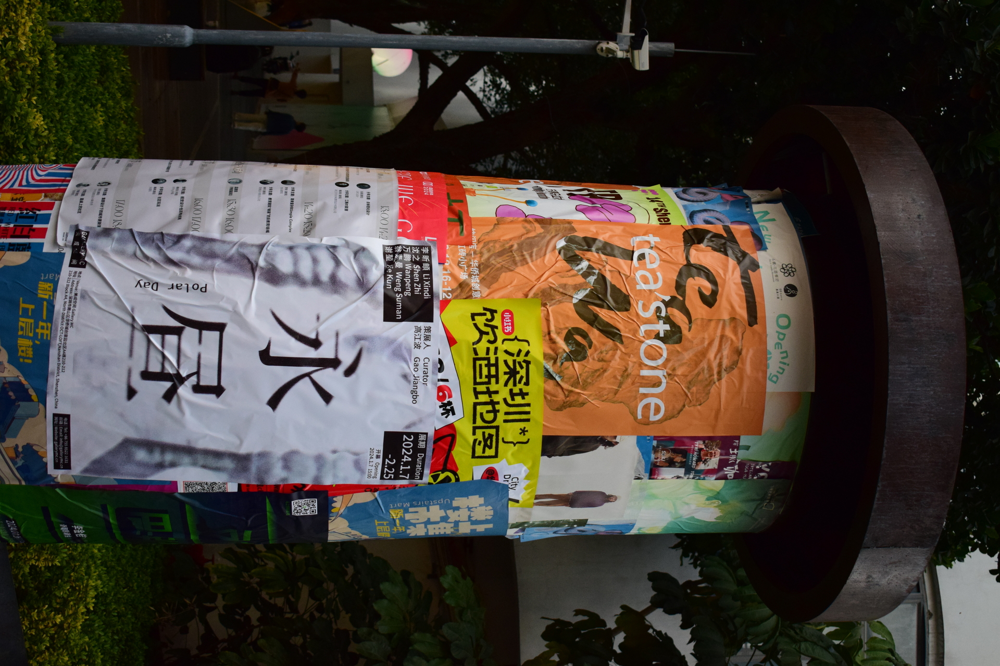
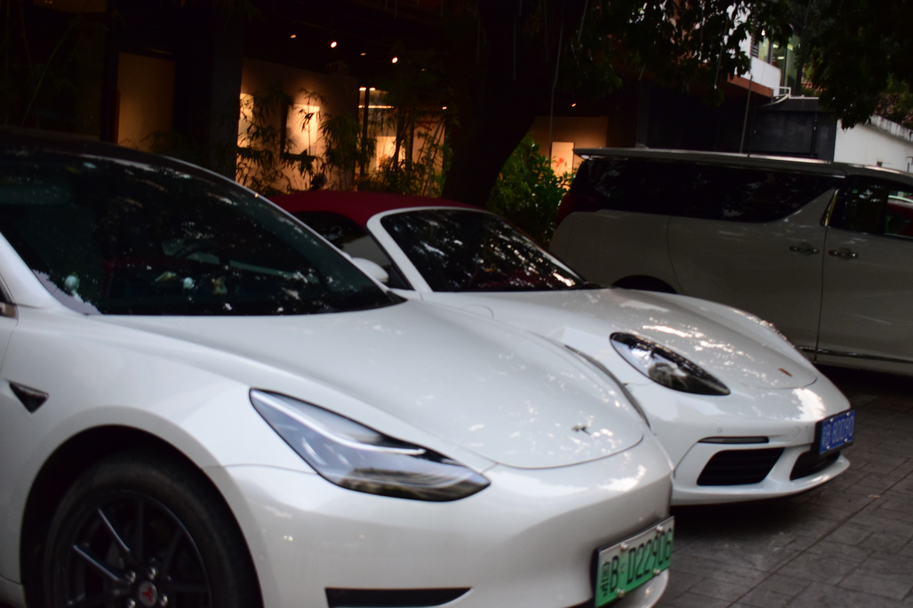
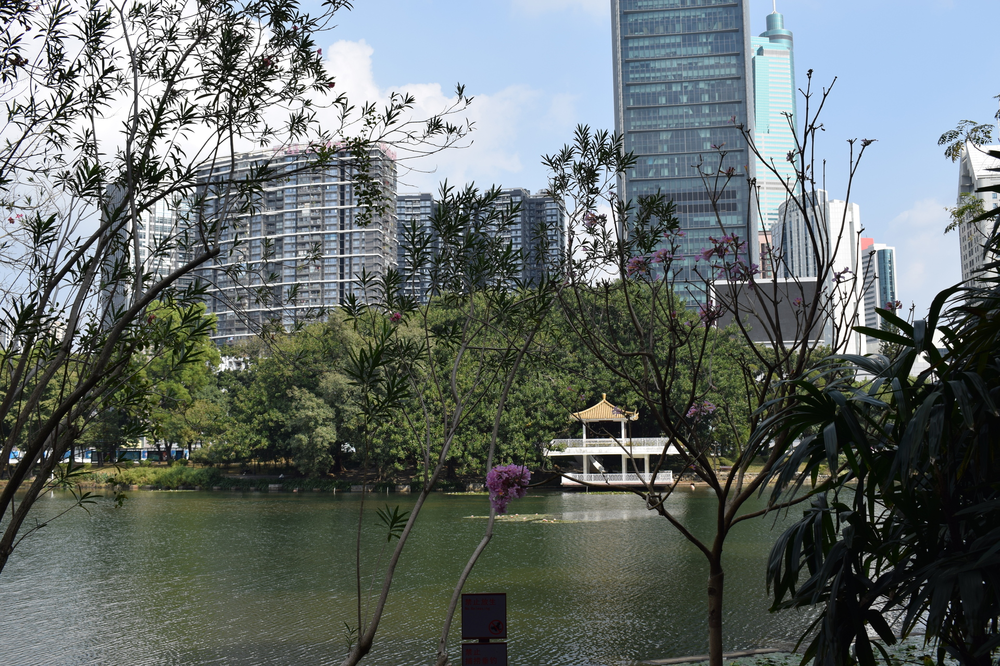
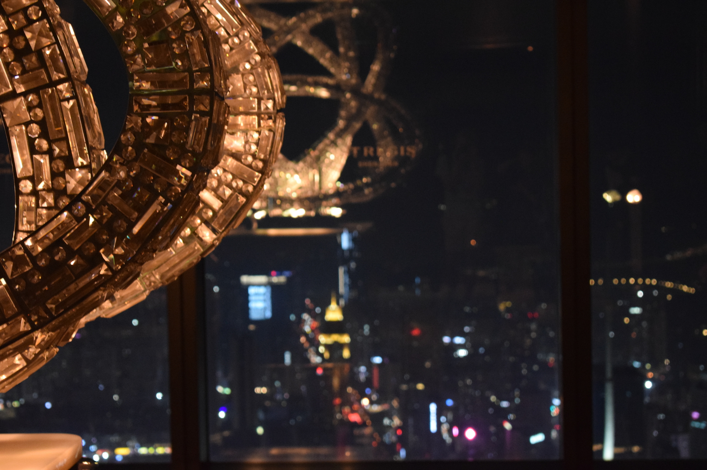
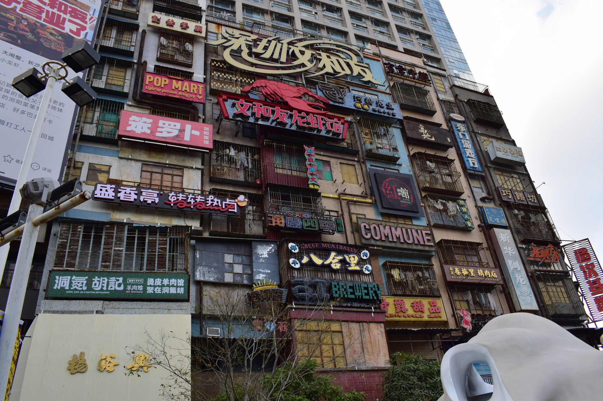
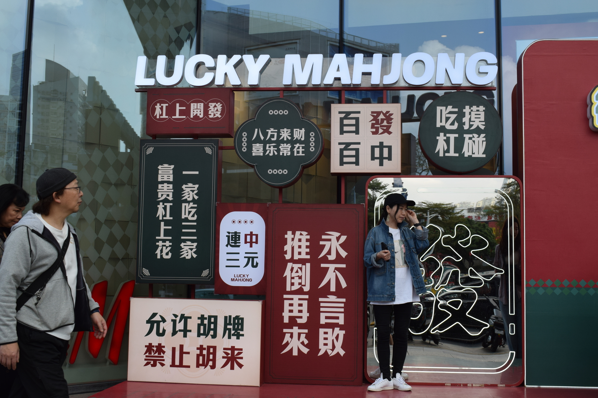

# Шеньчжень + Гуаньчжоу (Гуандун)

Created by: Екатерина Можегова
Created time: January 10, 2024 3:18 PM

Сколько провинций и городов уже объездили, до сих пор удивляемся китайскому разнообразию и богатству. Есть крупные города, высокие по уровню политической и экономической значимости — они по праву ухоженные, обеспеченные, местами “вылизанные”. Но в Китае такую характеристику можно дать не одному, не двум городам, да даже и не в таких порядках тут счет. 

Разные города обладают разными потенциалами и, естественно, разными бюждежтами, но все они словно логически объединены какой-то общей идеей. 

По инфраструктуре (транспортной системе, организации общественных мест), приложениям и сервисам маленькие города отличаются от мегаполисов только мастшабом. Если в столичном Пекине опрятное метро, то и в городах поменьше оно такое же аккуратное, даже дизайн зачастую похож. Чистые улицы как в Шанхае (там по улицам ходят специальные работники с метлами-крючками и удаляют с дороги все, чему не положено лежать на ней), так и в Гуйлине: в основном нет неухоженных и уж тем более откровенно загаженных улиц, особенно в прогулочных местах. 

То есть с переездом из одного китайского города в другой не чувствуешь кардинальной разницы в уровне развития. Если же в России вы, например, приезжаете в столицу, то словно оказываетесь в другом государстве.  

Однако при путешествии по Китаю может покидать по сезонам. Зимнее путешествие из Пекина в Шэньчжень перебросит вас из зимы в лето. 

Цивилизация в Шэньчжене развивается прямо в тропических зарослях. Круглогодичная жара, солнце, вездесущие ароматные растения, как в ботаническом саду, еще и птицы поют и чуть ли не вокруг тебя летают. Естественно такой город привлекает не только китайцев (Шэньчжень входит в топы городов мира по скорости прироста населения), но и многих туристов. Впрочем, понятно почему.

Город находится на юге Китая, в провинции Гуандун.

В рамках рыночных реформ в 70ых годах Шэньчжень начали обустраивать, и цель была серьезная — “новый” Шэньчжень задумывался как “китайский ответ Гонконгу”.

Город небоскребов.

Жили мы в модном новом районе, где расположился арт-квартал со стильными бутиками, центрами дизайна, молодежными кофейнями, кафе и ресторанами.

Возле многочисленных смузи-мест в этом районе паркуются Tesla, Lamborghini и прочие.

Вообще, в наши дни китайцы-богачи — нередкое явление. Обеспеченные китайцы любят тратить деньги, в том числе и напоказ: любят кричащие о их баснословном состоянии бренды, люксовые машины.

Шэньчжень — инновационный центр на стиле.

Одним из знаковых мест Шэньчженя и, пожалуй, всего Китая является рынок электроники. Это такой квартал высокоэтажных ТЦ, в котором продается абсолютно ВСЕ из мира техники. 

Провели мы там почти целый день, хотя приехали туда по большей части просто из любопытства. Более того, в квартале электроники мы починили всю сломанную технику: разбитые экраны ноутбука и планшета. Их нам починили за несколько часов по стоимости в разы ниже, чем если бы мы это сделали в России. Помимо этого прикупили еще несколько новых прикольных штук.

Изначально вообще думали, что в Китае закупимся техникой.
Если вы, например, давно мечтаете о какой-то определенной модели телефона и приезжаете в Китай в надежде ее купить, то скорее всего вас ждет… облом.

Китайцы уже давно весьма “упакованные”, уровень жизни в Китае сейчас выше, чем в России. Техника (даже та, которую они здесь же и производят) в Китае продается дороже, чем в России.
Есть и другой нюанс оффлайн шоппинга. Заходя в магазин с целью узнать про интересующую модель устройства, зачастую обнаруживаешь, что ее уже нет в продаже, а на витрине красуются уже новинки. Китайский прогресс несется темпами их скоростных поездов. Новинки техники появляются и тут же заменяются еще более продвинутыми вариантами.

Если же ты, человек из каменного века, пришел в магазин за телефончиком, выпущенным пару лет назад, то в лучших случаях тебе предложат оформить его под заказ, а иногда могут предложить б/у-шную альтернативу. Так мы купили объектив для камеры — выяснилось, что зеркальные камеры уже давно сменили беззеркалки.

---

Если же вы думаете, что Шэньчжень — это такой бездушный, каменный технополис, то категоричеки заблуждаетесь!

Шэньчжень богат уютными прогулочными местами. Во многих таких местах райская природа сочетается с элементами современности, но тем и привлекательнее.

На фоне традиционного китайского сада возвышаются небоскребы.

Конечно же, есть пруд с мостиком. 😊

Кстати, этот небоскреб является самым высоким зданием в Шэньчжене. Конечно же, мы в нем побывали.

Мы беспрепятственно прошли в отель на 96 этаже высотки, откуда открывается фантастичекая панорама.

Вид на ночной город. 

Пафос по-китайски.

Роскошь. Роскошь! Пожалуйста, больше роскоши!

Спасибо.

Вообще, в Шэньчжене довольно много пафосных развлечений, популярных среди как туристов, так и богатых китайцев. Побывали мы в парке SeaWorld. Территория парка обустроена в евпропейском стиле. 

Снова дорогие бутики.

Модная китайская ярмарка. 

А вот и вишенка! Корабль.

Пожалуй, хватит богатств. Нормальная жизнь в Шэньжене тоже существует.

В городе есть две известные улицы: улицы дешевой еды и дешевой одежды (Dongmen, Laojie). 

Часто в подобных местах можно увидеть китайских блогеров. Они что-то расказывают, показывают, поют — в общем, устраивают бесплатный перформанс для прохожих.

Древнекитайская империя Макдональдс.

Архитектура в Шэньчжене.

